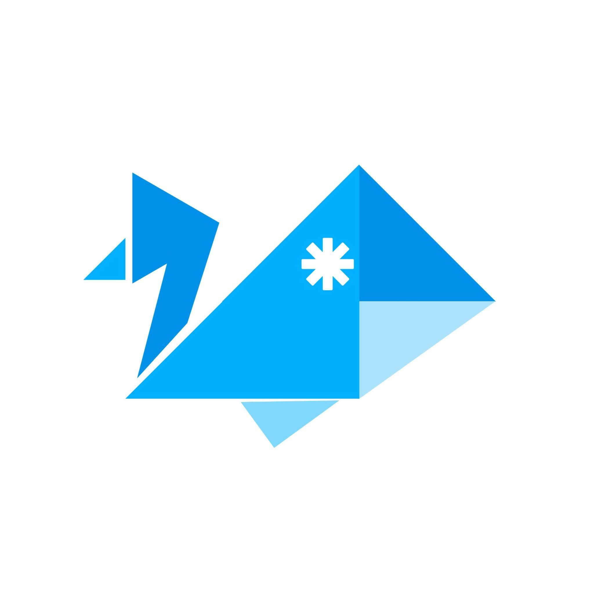
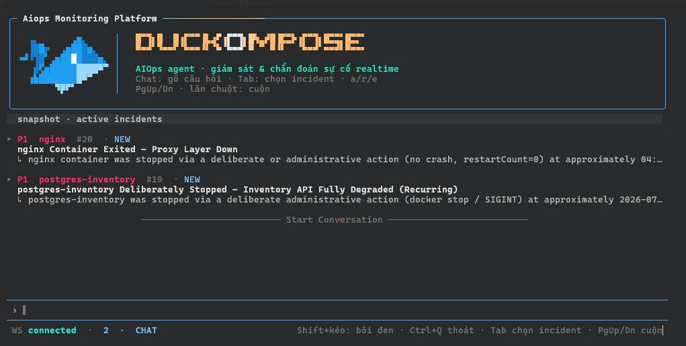
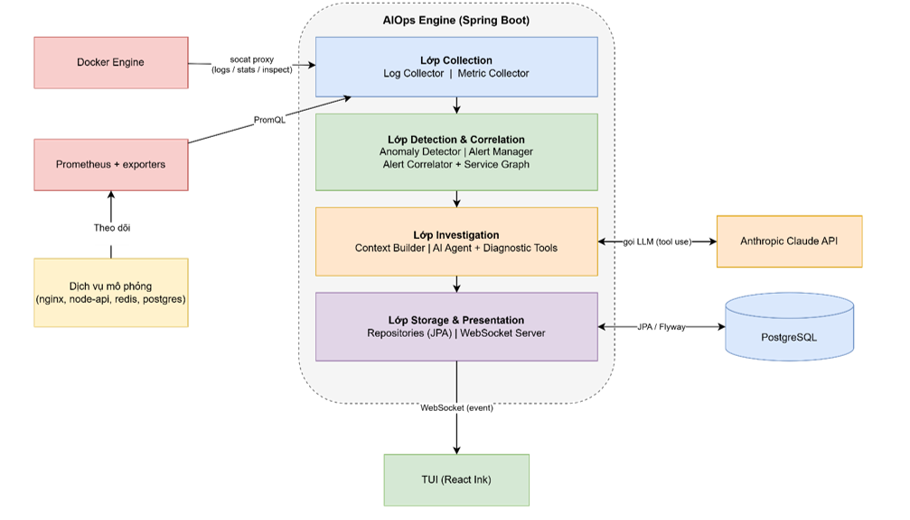
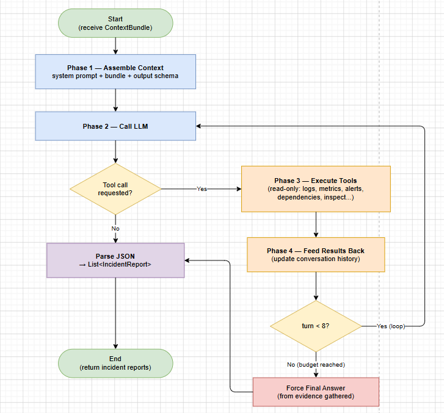
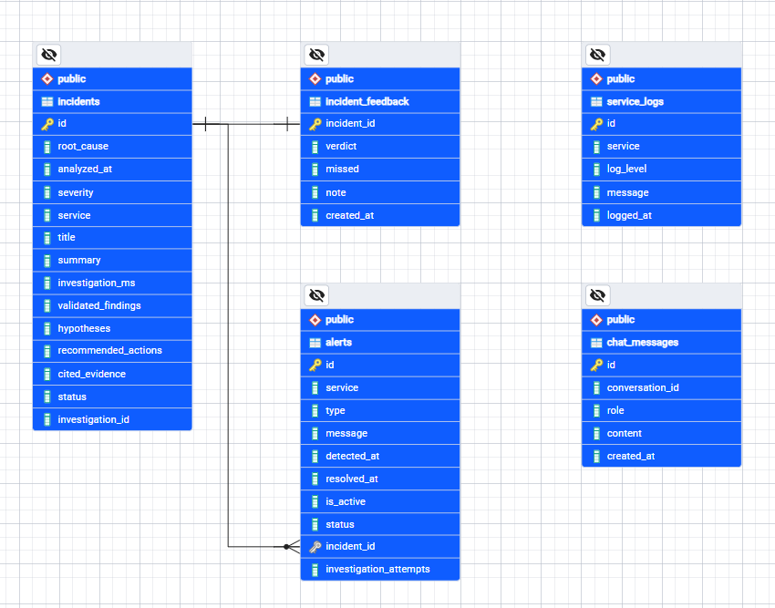
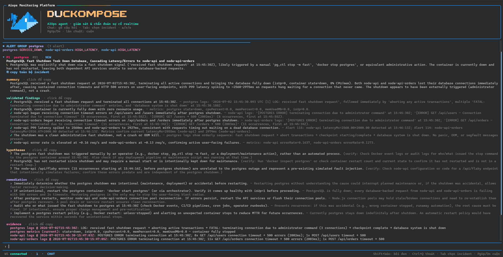

<!-- ═══════════════ IMAGE 1 — LOGO ═══════════════
     Paste the Duckompose duck logo. Save as: docs/images/logo.png -->
<p align="center">
  
</p>

<h1 align="center">Duckompose</h1>

<p align="center">
  <b>An AIOps platform where an AI Agent auto-investigates infrastructure incidents —<br>from a raw alert all the way to an evidence-backed root cause.</b>
</p>

<p align="center">
  
  
  
  
  
  
  
</p>

<p align="center"><i>Viettel Digital Talent 2026 · Software Engineer track</i></p>

---

## The problem — the gap between *"alert"* and *"action"*

Modern systems are meshes of interdependent microservices that emit a sea of logs, metrics
and alerts every second. When one service fails, a **single fault cascades into a storm of
alerts** across the whole system. The on-call engineer then faces:

- **Alert fatigue** — too many signals, hard to tell what actually matters.
- Alerts that only say *"something is wrong"*, not **why**.
- **Manual investigation** that leans heavily on individual experience.

**Duckompose closes that gap.** When an anomaly fires, it doesn't just raise an alert — it
builds a rich **context bundle** around the event and lets an **AI Agent investigate it like a
human SRE would**, returning a diagnosis you can act on immediately.

<!-- ═══════════════ IMAGE 2 — TUI SCREENSHOT ═══════════════
     Paste the terminal UI screenshot (the DUCKOMPOSE banner + feed).
     Save as: docs/images/tui.png -->
<p align="center">
  
</p>

---

## ✨ Key features

- 🛰️ **Real-time collection** — streams container logs via the Docker Engine (one virtual
  thread per container) and scrapes metrics from Prometheus with PromQL.
- 🚨 **Anomaly detection** — static-threshold rules per service *type* (service down, high
  P99 latency, error-rate spike, Redis OOM, DB connection exhaustion). The 5-second scan
  **fans out across virtual threads**, one per service.
- 🕸️ **Alert correlation** — a **Union-Find over the service dependency graph** groups related
  alerts into a single incident candidate and picks the topological root, so multiple
  symptoms of one fault become **one incident, not a storm**.
- 🧠 **The AI Agent is the heart** — a self-driven **4-phase loop** calls the LLM with read-only
  diagnostic tools, gathers evidence, and returns structured `IncidentReport`s. Everything
  else (collection, detection, storage, UI) is a **plugin around this core**.
- 🔎 **Evidence discipline** — every diagnosis separates **validated findings** from
  **hypotheses** (each with *what still needs checking*) and **cites the exact log/metric**
  it relied on — no hand-waving.
- 💬 **Interactive chat + history** — ask *"why is node-api slow?"* and the same agent brain
  answers with token streaming; conversations are **persisted in PostgreSQL** and browsable
  via `/conversation-history` (list → replay).
- 👍 **Human feedback loop** — rate any diagnosis (`correct / partial / wrong`) with a
  **miss-taxonomy** (*what did it get wrong?*) and a note; stored 1:1 per incident as an
  evaluation signal (store-only, OpenSRE-inspired).
- 🔀 **Model-agnostic** — swap the LLM by config only (Claude *Sonnet 4.6* as primary,
  **MiniMax M3** as a ~10× cheaper alternative) thanks to Spring AI's `ChatModel` abstraction.
- 🖥️ **Terminal UI** — a React Ink TUI (`duckompose`) shows investigations live over WebSocket.
- 🧪 **Tested & portable** — 35 unit tests, a two-way precision/recall check, and a failure
  simulator in **both PowerShell and Bash**.

---

## 🏗️ Architecture — four layers

<!-- ═══════════════ IMAGE 3 — 4-LAYER ARCHITECTURE (drawio) ═══════════════
     Paste the "Kiến trúc tổng quan 4 lớp" drawio (report Hình 3.1).
     Save as: docs/images/architecture.png -->
<p align="center">
  
</p>

| Layer | Responsibility | Core components |
|-------|----------------|-----------------|
| **Collection** | Ingest raw telemetry | Log Collector · Metric Collector |
| **Detection & Correlation** | Turn telemetry into incidents | Anomaly Detector · Alert Manager · Alert Correlator + Service Graph |
| **Investigation** | Diagnose the incident | Context Builder · **AI Agent** + diagnostic tools |
| **Storage & Presentation** | Persist & surface results | JPA repositories · WebSocket server → TUI |

**End-to-end flow:** `detect → correlate → investigate → persist → stream to TUI`.

> **Core-plugin view:** the AI Agent owns *investigation & diagnosis* (the value); the other
> layers are pluggable connectors that feed context in and carry conclusions out — so the
> system can grow toward an *agentic OS* without touching the brain.

---

## 🔬 How the Agent investigates — the 4-phase loop

<!-- ═══════════════ IMAGE 4 — AGENT 4-PHASE LOOP (drawio) ═══════════════
     Paste the "Luồng điều tra của AI Agent" drawio (docs/diagrams/hinh-luong-agent-dieu-tra.drawio).
     Save as: docs/images/agent-loop.png -->
<p align="center">
  
</p>

1. **Assemble Context** — system prompt + context bundle + the expected JSON output schema.
2. **Call LLM** — the model decides whether it needs more evidence.
3. **Execute Tools** — read-only diagnostic tools (logs, metrics, alerts, dependencies,
   container inspect) run and their results are fed back.
4. **Feed Results Back** — loop until the model is confident (bounded by a turn budget), then it
   emits a `List<IncidentReport>`.

Tool execution is driven **manually** (not auto) so the loop stays under our control — with a
`MAX_TURNS` guard, a *force-final-answer* fallback, and prose-tolerant JSON extraction.

---

## 🗃️ Data model

<!-- ═══════════════ IMAGE 5 — ERD ═══════════════
     Paste the DB schema / ERD (report Hình 3.5).
     Save as: docs/images/erd.png -->
<p align="center">
  
</p>

- **`service_logs`** — logs streamed from containers in real time.
- **`alerts`** — fired anomalies (service, type, status, `is_active`), linked to their incident.
- **`incidents`** — the agent's diagnosis: root cause, severity, validated findings,
  hypotheses, recommended actions and cited evidence.
- **`incident_feedback`** — human verdict + miss-taxonomy + note, 1:1 with an incident (store-only).
- **`chat_messages`** — persistent chat history, so conversation context survives restarts.

Schema is owned by **Flyway migrations** and only *validated* by JPA at startup.

---

## 🛠️ Tech stack

| Area | Technology |
|------|-----------|
| **Engine** | Java 21 (virtual threads / Project Loom), Spring Boot 3.5, WebSocket |
| **AI** | Spring AI → Claude (Sonnet 4.6) primary · MiniMax M3 alternative; manual tool-calling agent loop |
| **Collection & Metrics** | `docker-java`, Prometheus + PromQL |
| **Storage** | PostgreSQL, Spring Data JPA, Flyway |
| **Infrastructure** | Docker Compose, Socat proxy (Docker socket → TCP) |
| **TUI** | React + Ink (TypeScript), WebSocket |
| **Testing** | JUnit 5 + Mockito + AssertJ (35 unit tests) |

---

## 🚀 Getting started

### Prerequisites
- Docker Desktop (Docker Compose v2)
- Node.js 18+ (for the TUI)
- An **`ANTHROPIC_API_KEY`** (or a `MINIMAX_API_KEY` if using MiniMax)

### 1 · Configure secrets
Create `aiops/infra/.env`:
```env
ANTHROPIC_API_KEY=sk-ant-...
AIOPS_DB_PASSWORD=change_me
APP_DB_PASSWORD=change_me
```

### 2 · Start the stack
> ⚠️ Start the **simulation first** — it creates the shared Docker network the engine joins.
```bash
# 1) Simulated microservice topology (project: aiops-sim)
docker compose -f aiops/infra/docker-compose.yml up -d

# 2) The AIOps engine + Prometheus + state DB (project: aiops-platform)
docker compose -p aiops-platform -f aiops/infra/docker-compose.backend.yml up -d --build
```

### 3 · Launch the TUI
```bash
duckompose            # if the global command is installed
# or, straight from source:
node aiops/tui/dist/index.js
```
The TUI connects to the engine at `ws://localhost:8088/ws/incidents`.

> **Switch model:** to use MiniMax instead of Claude, comment the `spring.ai.anthropic`
> Claude block and uncomment the MiniMax block in `aiops/app/src/main/resources/application.yaml`,
> set `MINIMAX_API_KEY`, then rebuild the engine.

---

## 🧪 Simulating incidents

From `aiops/infra/scripts/` — every scenario ships in **PowerShell (`.ps1`)** for Windows and
**Bash (`.sh`)** for Linux/macOS (or Git Bash on Windows):

| Scenario | PowerShell | Bash |
|----------|-----------|------|
| **Service down** | `.\simulate-container-down.ps1 -Service <name>` | `./simulate-container-down.sh --service <name>` |
| **High latency** | `.\simulate-high-latency.ps1 -Service <name>` | `./simulate-high-latency.sh --service <name>` |
| **Redis OOM** | `.\simulate-redis-oom.ps1` | `./simulate-redis-oom.sh` |
| **DB exhaustion** | `.\simulate-db-exhaustion.ps1 -Service <name>` | `./simulate-db-exhaustion.sh --service <name>` |
| **Load / error spike** | `.\simulate-load-spike.ps1 -Service <name>` | `./simulate-load-spike.sh --service <name>` |
| **Recover everything** | `.\recover.ps1 <scenario>` | `./recover.sh <scenario>` |
| **Run all (demo)** | `.\run-all-simulations.ps1` | `./run-all-simulations.sh` |
| **Precision check** (no fault → no false alert) | `.\check-false-positive.ps1` | `./check-false-positive.sh` |

Trigger a scenario, then watch the TUI: an alert fires → related alerts group → the agent
investigates → an evidence-backed incident appears.

<!-- ═══════════════ IMAGE 6 — RESULT / INCIDENT REPORT ═══════════════
     The "Kết quả đạt được" incident screenshot. Save as: docs/images/results.png -->
<p align="center">
  
</p>

---

## ✅ Testing & evaluation

Reliability is checked at **two layers matched to the nature of an AI system**:

- **Deterministic scaffolding → unit tests (35, JUnit).** The prose-tolerant JSON extractor,
  the Union-Find correlator, the dependency graph, the threshold rules, and the agent loop
  (with a **mocked model** — loop termination, `MAX_TURNS` guard, output parsing).
- **LLM judgement → empirical benchmark.** Each scenario is run **3×** and scored (severity vs
  expectation, root-cause correctness) — for both **Claude** and **MiniMax M3**.
- **Precision & recall, two ways.** Fault-injection scripts prove *recall* (faults are caught);
  `check-false-positive` runs a healthy system and proves **no false alerts** fire (*precision*).

---

## 📁 Project structure

```
VDT_AIOPS/
├── aiops/
│   ├── app/     # Java Spring Boot engine (detection, correlation, agent, storage)
│   ├── tui/     # React Ink terminal UI
│   └── infra/   # docker-compose files, prometheus.yml, simulation scripts (.ps1 + .sh), mock services
├── docs/        # diagrams (.drawio) & images
└── README.md
```

---

## ⚠️ Limitations & roadmap

| Limitation | Direction |
|------------|-----------|
| Detection uses **static thresholds** (no adaptive baseline) | Statistical / adaptive detection (z-score, seasonal baselines) |
| Correlation is **time-window based** — a lagging symptom can be split from its root cause | Post-hoc causal linking, not just a fixed quiet-window |
| The service **dependency graph is built once at startup** | Dynamic topology updates (Docker events / periodic refresh) |
| **Single-process engine**, bounded concurrency | Split into queue-fed workers with shared state (PG/Redis) |
| Runs only in the **simulated Docker environment**; **diagnoses, does not remediate** | Real infra via plugins/**MCP** (Prometheus/Grafana/ELK, Docker/Postgres/AWS MCP); multi-channel alerts (email/on-call/Slack); **MCP-driven remediation** under a permission & security layer — toward a multi-agent *Agentic OS* |

---

## 👤 Author

**Nguyễn Văn Hùng** · Viettel Digital Talent 2026 
📧 darkisknight126@gmail.com

<p align="center">
  <br>
  <i>Built for learning — understanding AIOps patterns, context-driven AI analysis, and integrating LLMs into observability workflows.</i>
</p>
